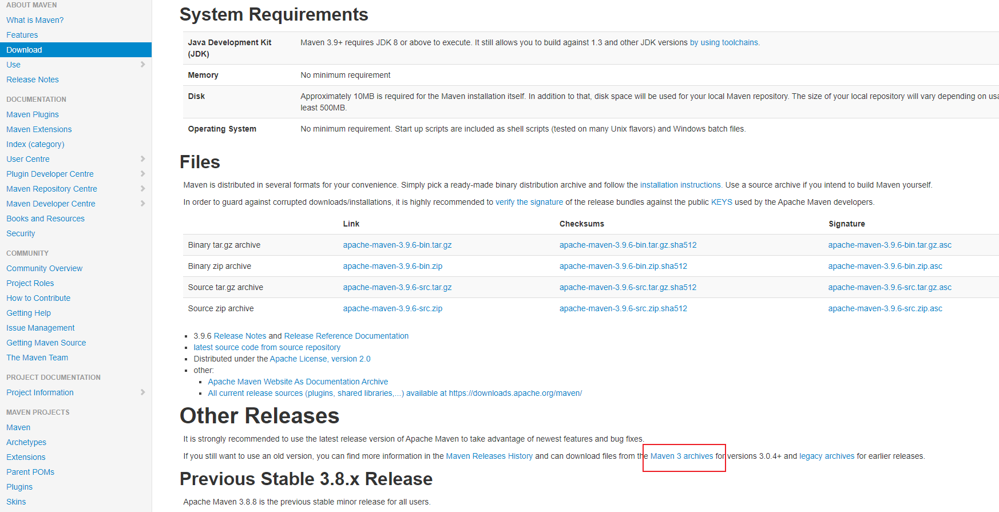
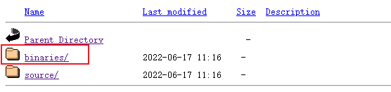
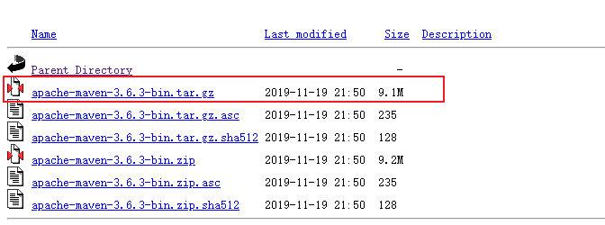
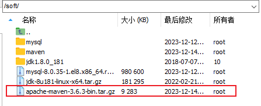
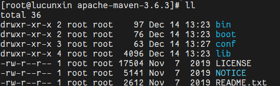
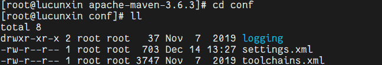
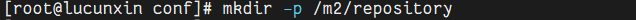
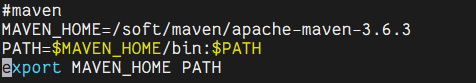
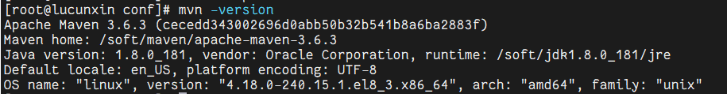

### 1.官网下载地址

[https://maven.apache.org/download.cgi](https://maven.apache.org/download.cgi)




##### 选择版本






##### 上传至服务器



### 2.安装

##### 创建maven文件夹

```Plain Text
mkdir -p /soft/maven
```

##### 解压到maven文件夹

```Plain Text
tar -zxvf apache-maven-3.6.3-bin.tar.gz -C /soft/maven
```

### 3.修改镜像与环境变量

##### 进入到maven目录

```Plain Text
cd /soft/maven/apache-maven-3.6.3
```



##### 进入 conf 目录

```Plain Text
cd conf/
```



##### 创建 maven 资源库目录

```Plain Text
mkdir -p /m2/repository
```



##### 编辑 settings.xml 文件

先将原文件内容全部删除，添加新的配置内容

##### 删除settings.xml中内容

```Plain Text
truncate -s 0 settings.xml
```

##### 编辑settings.xml

##### 修改资源库位置，添加阿里云国内镜像

```Shell
<?xml version="1.0" encoding="UTF-8"?>
 
<settings xmlns="http://maven.apache.org/SETTINGS/1.2.0"
          xmlns:xsi="http://www.w3.org/2001/XMLSchema-instance"
          xsi:schemaLocation="http://maven.apache.org/SETTINGS/1.2.0 https://maven.apache.org/xsd/settings-1.2.0.xsd">
 
  <localRepository>/m2/repository</localRepository>
  
  <pluginGroups>
  </pluginGroups>
 
  <proxies>    
  </proxies>
 
  <servers>
  </servers>
 
  <mirrors>
    <mirror>  
   	  <id>alimaven</id>  
   	  <name>aliyun maven</name>  
	  <url>http://maven.aliyun.com/nexus/content/groups/public/</url>  
   	  <mirrorOf>central</mirrorOf>          
    </mirror> 
  </mirrors>
 
  <profiles>
  </profiles>
</settings>
```

##### 添加环境变量

```Shell
vim /etc/profile
```

##### 在末尾加上

```Shell
#maven
MAVEN_HOME=/soft/maven/apache-maven-3.6.3
PATH=MAVEN_HOME/bin:PATH
export MAVEN_HOME PATH
```



##### 重新加载配置文件

```Shell
source /etc/profile
```

##### 查看版本

```Shell
mvn -version
```



