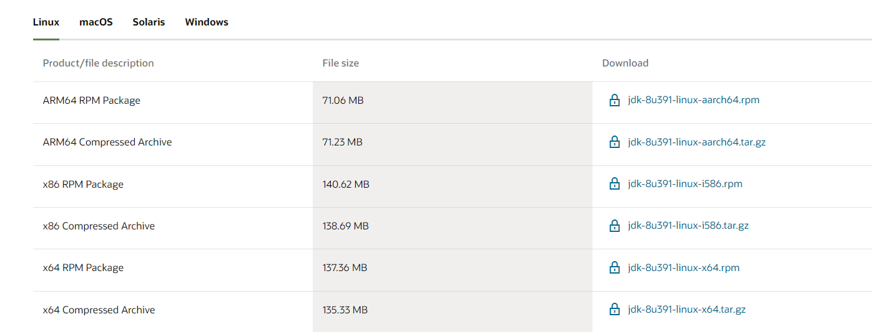
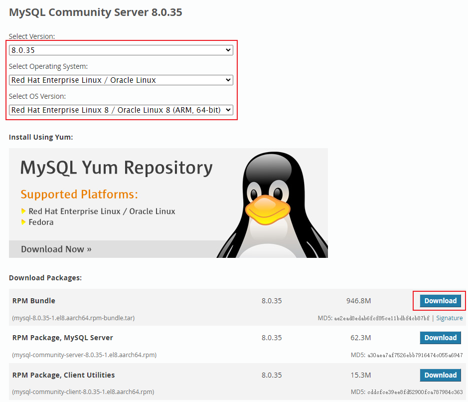
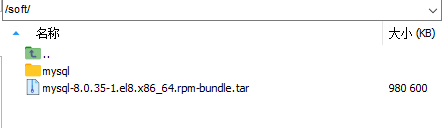
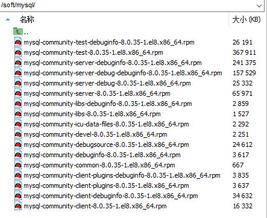
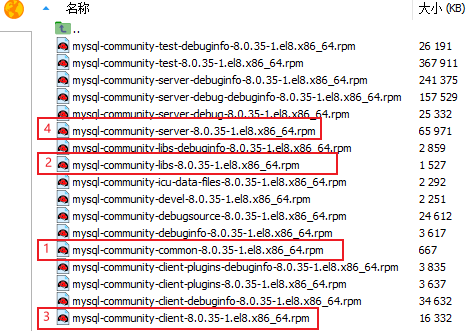
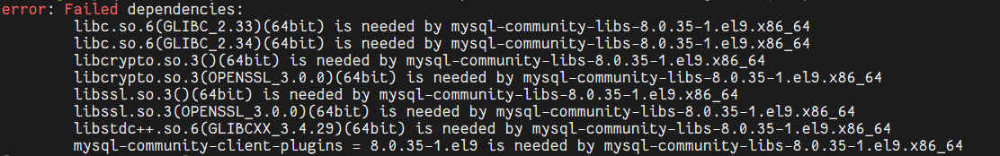
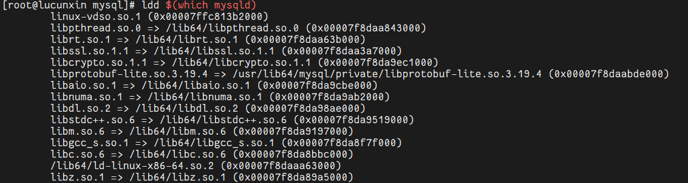
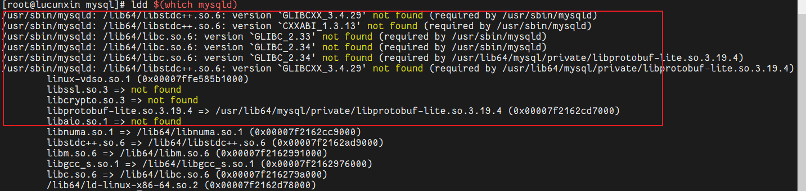
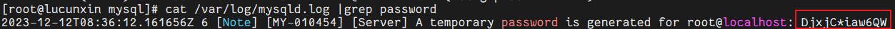

### 1.下载安装包

[https://dev.mysql.com/downloads/mysql/](https://dev.mysql.com/downloads/mysql/)



### 2.安装Mysql

卸载CentOS中的预安装Mysql，不一定需要操作

```Plain Text
rpm -qa | grep -i mysql
rpm -e mysql-libs-5.1.71-1.el6.x86_64 --nodeps
或者 yum remove mysql-libs
```

如果有mariadb，删除

```Plain Text
rpm -qa|grep mariadb
rpm -e --nodeps mariadb-libs
```

是否有mysql文件夹，有删除

```Plain Text
find / -name mysql
whereis mysql
```

##### 上传 mysql 的安装包：

创建mysql文件夹并且解压：



```Plain Text
mkdir /soft/mysql
```

```Plain Text
tar -xvf mysql-8.0.35-1.el8.x86_64.rpm-bundle.tar -C /soft/mysql
```

##### 解压之后：



##### 因为mysql的依赖关系，依次按顺序解压rpm文件



```Plain Text
rpm -ivh mysql-community-common-8.0.35-1.el8.x86_64.rpm
rpm -ivh mysql-community-libs-8.0.35-1.el8.x86_64.rpm --force --nodeps
rpm -ivh mysql-community-client-8.0.35-1.el8.x86_64.rpm --force --nodeps
rpm -ivh mysql-community-server-8.0.35-1.el8.x86_64.rpm --force --nodeps
```

如果执行报错



在命令后加上--force --nodeps

```Plain Text
rpm -ivh mysql-community-libs-8.0.35-1.el8.x86_64.rpm --force --nodeps
```

##### 为了保证数据库目录为与文件的所有者为 mysql 登陆用户，如果你是以 root 身份运行 mysql 服务，需要执行下面的命令初始化

##### 检测依赖

```Plain Text
ldd $(which mysqld)
```



如果缺少依赖，需要下载对应依赖或者更换MySQL版本




```Plain Text
mysqld --initialize --user=mysql
```

### 3.启动 MySQL 服务

开启

```Plain Text
systemctl start mysqld.service
```

关闭

```Plain Text
systemctl stop mysqld.service
```

查看状态

```Plain Text
systemctl status mysqld.service
```

重启

```Plain Text
systemctl restart mysqld.service
```


### 4.登录MySQL

获取mysql自动生成的密码：

```Plain Text
cat /var/log/mysqld.log |grep password
```



登录

```Plain Text
mysql -u root -p
```

登录之后, 修改密码 :

```Plain Text
set password for root@localhost='123456';
```

授权远程访问 :

```Plain Text
grant all privileges on *.* to ‘root‘@‘%‘ identified by ‘123456‘ with grant optio
```

```Plain Text
flush privileges;
```


### 5.总结

#### 如果执行mysqld --initialize --user=mysql时候缺少依赖

##### 方法一：安装 OpenSSL 3

使用包管理器（`yum`）安装 OpenSSL 3：

```Plain Text
sudo yum install openssl-libs
```

##### 方法二：软链接到已存在的库文件

查找系统中已经存在的 `libssl` 和 `libcrypto` 的库文件：

```Plain Text
sudo find / -name "libssl*" -type f
sudo find / -name "libcrypto*" -type f
```

如果找到了相应的库文件，可以尝试创建软链接到它们：

```Plain Text
sudo ln -s /path/to/existing/libssl.so.x /usr/lib64/libssl.so.3
sudo ln -s /path/to/existing/libcrypto.so.x /usr/lib64/libcrypto.so.3
```

其中，`/path/to/existing/` 是找到的现有库文件的路径，`x` 是版本号。

