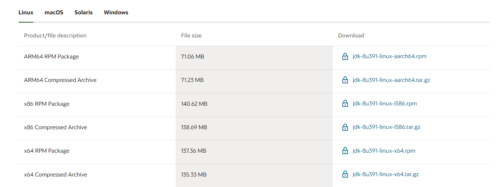

### 下载JDK
[下载地址](https://www.oracle.com/java/technologies/downloads/#java8/)
##### 进入页面后下载64位的包，jdk-8u181-linux-x64.tar.gz与jdk-8u181-linux-x64.rpm都可以，下面会分别介绍两种包的安装方法，选择其中一种进行安装即可。



### 上传至服务器并解压


### 配置环境变量

##### 修改配置文件，配置环境变量，在命令行输入：
```F#
vi /etc/profile
```


#### 输入“G”定位到最后一行，按“i”进入编辑模式，在最下面添加如下几行信息：
```Java
export JAVA_HOME=/soft/jdk1.8.0_181
export PATH=PATH:JAVA_HOME/bin
export CLASSPATH=.:JAVA_HOME/lib/dt.jar:JAVA_HOME/lib/tools.jar
export JRE_HOME=$JAVA_HOME/jre
```

##### 如图：


#### 添加完之后按ESC退出编辑模式，输入:wq后回车（保存并退出）

### 重载环境变量

```F#
source /etc/profile
```

### 查看安装情况

```F#
java -version
```

##### 安装成功后会出现如下版本信息：


### 卸载JDK

##### 将安装包删除，然后把配置文件内添加的环境变量删除

##### 删除安装包的命令如下：

```F#
rm -rf /soft/jdk1.8.0_181
```

##### 修改配置文件的方法和上述配置环境变量一样


